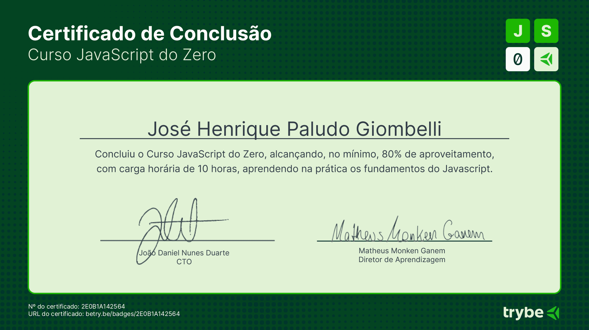

# Curso-Javascript-Trybe

Repositório com exercícios e exemplos do curso, Conteúdos Aprendidos:    

# 1. Variáveis
Descrição: Aprendi sobre os diferentes tipos de variáveis em JavaScript e como utilizá-las para armazenar dados.
Exemplos: var, let, const. 

Aplicação: Utilizar variáveis para armazenar e manipular informações ao longo do código.

# 2. Estruturas Condicionais
Descrição: Entendi como utilizar estruturas condicionais para tomar decisões no código com base em diferentes condições.
Exemplos: if, else if, else.  

Aplicação: Controlar o fluxo do programa com base em condições específicas.  

# 3. Laços de Repetição
Descrição: Aprendi a usar loops para repetir blocos de código de forma eficiente.
Exemplos: for, while, do...while.

Aplicação: Iterar sobre arrays, repetir operações até que uma condição seja satisfeita, etc.  

# 4. Funções
Descrição: Entendi como encapsular blocos de código em funções para reutilização e organização.
Exemplos: Declaração de funções.

Aplicação: Criar funções para realizar tarefas específicas e reutilizá-las em diferentes partes do código.

# Certificado de coonclusão:    

